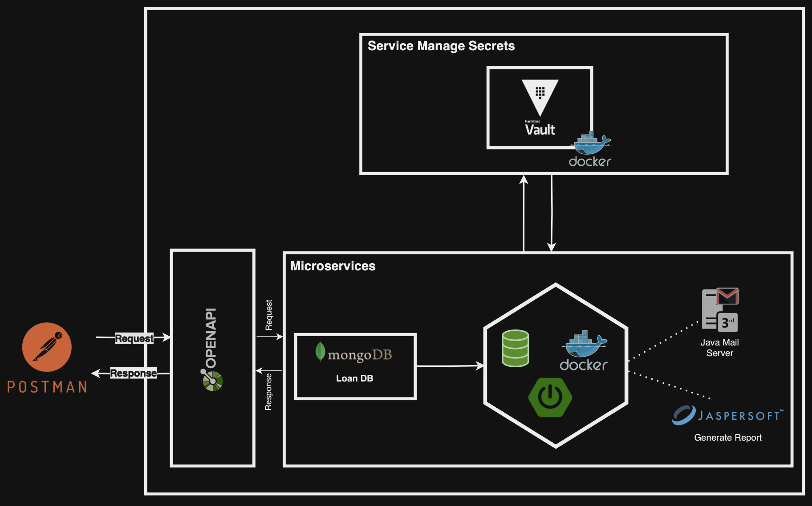
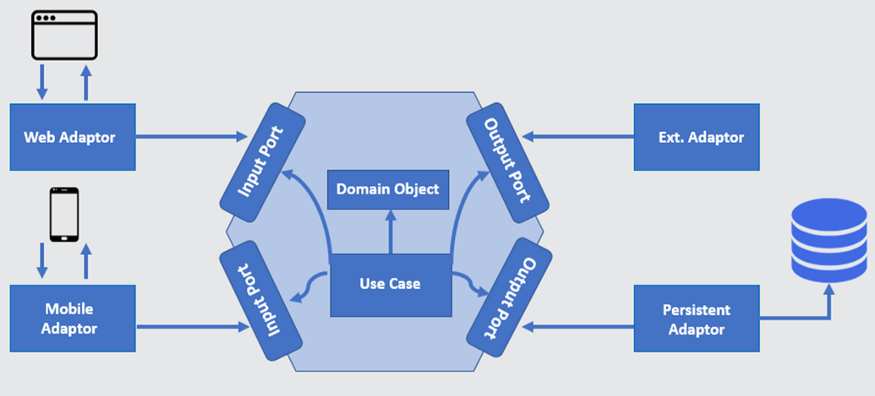

# API Loan Project
API that facilitates loan simulation using the French method. To utilize this service, clients simply need to provide the loan data. After performing the loan simulation, our system will automatically generate a PDF report and send it to the client via email.

## Architecture
Below is the architectural diagram for API Loan project.

<p align="center"></p>

> [!NOTE]
> - [x] Design & Documentation
> 	- OpenAPI 3
> - [x] Secret Management
> 	- HashiCorp Vault
> - [x] Development
> 	- Spring Boot 3.+ 
> 	- JasperReport
> 	- Spring Mail
> 	- MongoDB
> 	- Docker
> - [x] Mockups
> - [x] Unit testing
> 	- JUnit 5
> 	- Cucumber
> - [x] Features Testing
> 	- Gherkins
> - [x] Deployment
> 	- Docker

## Pre-requisites
Before works with API Loan project you need to install vault in your local machine, below is an example for MacOS

```bash
brew tap hashicorp/tap
brew install hashicorp/tap/vault
```

Following is the way to run the Vault Docker container with docker-compose.yaml example (installed in Docker Desktop)

```yaml
version: '3.3'

services:
  vault:
    image: hashicorp/vault:latest
    container_name: vault
    ports:
      - "8200:8200"
    restart: unless-stopped  
    environment:
      VAULT_DEV_ROOT_TOKEN_ID: "00000000-0000-0000-0000-000000000000"
      VAULT_DEV_LISTEN_ADDRESS: "0.0.0.0:8200"
      VAULT_API_ADDR: "http://0.0.0.0:8200"
    volumes:
      - ./vault-data:/vault/file    
      - ./vault-config:/vault/config
    cap_add:
      - IPC_LOCK
    networks:
      - vault_network

networks:
  vault_network:
```

```bash
docker compose up -d
```

Vault web interface can be accessed in "http://< docker host ip >:8200" in host machine.

Add the vault address environment variable to the client by running the following command: 

```bash
export VAULT_ADDR='http://<docker host ip>:8200'
export VAULT_TOKEN="00000000-0000-0000-0000-000000000000"
vault status
```

> [!TIP]
> To run this API locally, *install 2 dependencies by adding them to your local maven repository*:
> - **Jaspert Report Integrator Component**
> - **Mail Integrator Component**

### Technology

Microservices sample project uses a number of open source projects to work properly:

* [SpringBoot] - Application framework
* [MongoDB] - NoSQL database
* [HashiCorp Vault] - Manage secrets
* [Jasper Report] - Generate reports
* [Java Mail] - Mail Server
* [Docker] - Containerization platform
* [Swagger] - API documentation

### Tools

* [Java] - Programming
* [Maven] - Build
* [Git] - Version control
* [Docker] - Deployment

> [!IMPORTANT]
> API Implementing **Hexagonal Architerure**, also known as Ports and Adapters, is a software development design pattern. It's used to create flexible and maintainable software systems.
<p align="center"></p>
