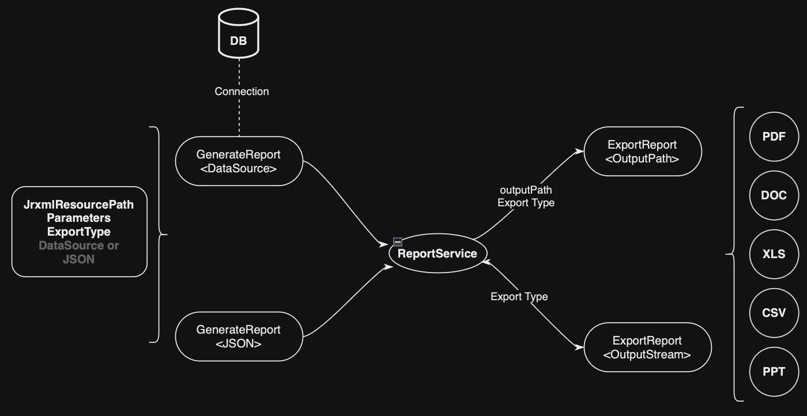

## About Jasper Report Integrator

## Reference
Project Based on Jasper Report Connector *(https://github.com/wavemaker/jasper-reports-connector)*
 
## Introduction
JasperReports is an open source java reporting engine. JasperReports is a Java class library, and it is meant for those Java developers who need to add reporting capabilities to their applications.

This aaplication will provides multiple api to generate jasper report. In addition it also support of export following export type
HTML, PDF, XLS, CSV, DOC

## Prerequisite
1. Java 1.8 or above
2. Maven 3.1.0 or above
3. Any java editor such as Eclipse, IntelliJ ...etc
4. Internet connection

## How services work
<p align="center">
  
</p>

## Test (Use Cases)
You can test this application using following command

```bash
mvn clean test
```

## Build
You can build this application using following command, if all is OK you can skip test *-DskipTests* (No recommend!)

```bash
mvn clean install
```

## Deploy
You can copy jasper-report-integrator.jar to your server or you can add dependency on your pom.xml

```xml
	<dependency>
		<groupId>com.integrator.jasper.report</groupId>
		<artifactId>jasper-report-integrator</artifactId>
		<version>1.0.0</version>
	</dependency>
```