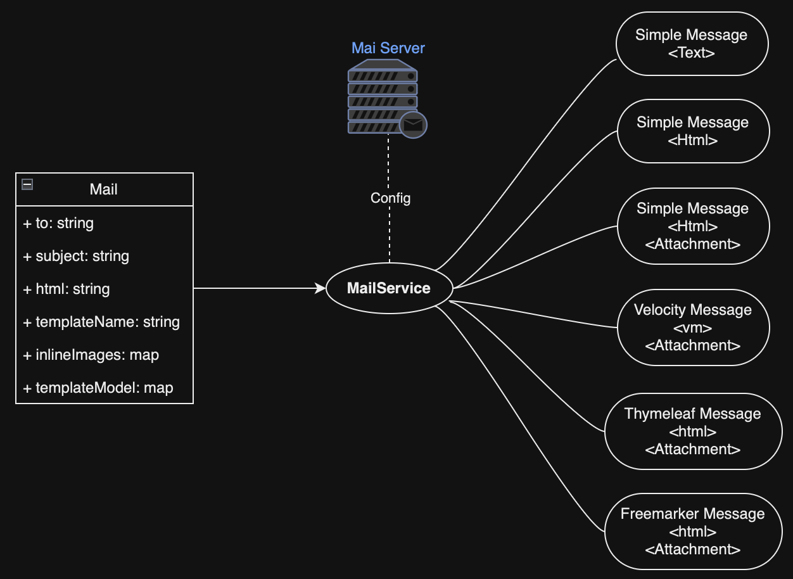

## About Jasper Report Integrator

## Introduction
JavaMail API provides a platform-independent and protocol-independent framework to build mail and messaging applications. The JavaMail API is available as an optional package for use with the Java SE platform and is also included in the Java EE platform.

## Prerequisite
1. Java 1.8 or above
2. Maven 3.1.0 or above
3. Any java editor such as Eclipse, IntelliJ ...etc
4. Internet connection

## Config Mail Server

Gmail Server: Go to Google Account settings page, then search for “app password” and Add your *password*.

**application.yml** for main resource

```
spring:
   mail:
      default-encoding: UTF-8
      host: smtp.gmail.com
      port: 587
      username: xxxx@gmail.com
      password: <password>
      properties:
         mail:
            smtp:
               auth: true
               starttls:
                  enable: true
      protocol: smtp
      test-connection: false
      templates:
         path: templates
```
**application.properties** for test resource

```
spring.mail.default-encoding: UTF-8
spring.mail.host=smtp.gmail.com
spring.mail.port=587
spring.mail.username=xxxx@gmail.com
spring.mail.password=<password>
spring.mail.properties.mail.smtp.auth=true
spring.mail.properties.mail.smtp.starttls.enable=true
spring.mail.protocol=smtp
spring.mail.test-connection=false
spring.mail.templates.path=templates
```

## How services work
<p align="center">
  
</p>

## Test (Use Cases)
You can test this application using following command

```
mvn clean test
```

## Build
You can build this application using following command, if all is OK you can skip test *-DskipTests* (No recommend!)

```
mvn clean install
```

## Deploy
You can copy mail-integrator.jar to your server or you can add dependency on your pom.xml

```
	<dependency>
		<groupId>com.integrator.mail</groupId>
		<artifactId>mail-integrator</artifactId>
		<version>1.0.0</version>
	</dependency>
```